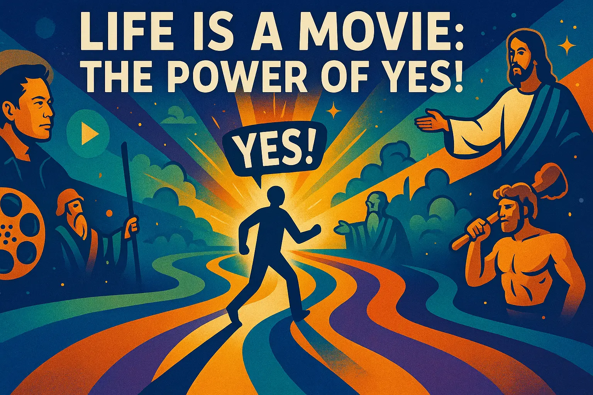

## La Vida Es Una Película: ¡El Poder del "Sí"!

El concepto de abrazar el destino y dar pasos audaces hacia un futuro incierto es un tema atemporal que ha resonado a lo largo de la historia. Muchas personas que han moldeado el mundo han tenido que tomar decisiones difíciles, a menudo dejando atrás a sus familias, hogares y zonas de confort para seguir un llamado más alto. Este patrón de comportamiento no es exclusivo de una sola persona o grupo, sino más bien un hilo común que entrelaza las historias de héroes y visionarios de diversas trayectorias.

Desde figuras bíblicas como Jesús, Moisés y Hércules, hasta íconos contemporáneos como Elon Musk y Bill Clinton, la narrativa de abandonar la familiaridad y abrazar lo desconocido es recurrente. Es una prueba de coraje, resiliencia y determinación, una que separa a aquellos que están dispuestos a asumir riesgos y desafiar el status quo de quienes prefieren jugar a lo seguro. La prueba principal de los héroes, como se ve en las historias de Jesús y sus discípulos, implica:

* Dejar a tu familia, especialmente a los hijos, por al menos un año
* Viajar a tierras extranjeras, por al menos un año (usualmente 5)
* Aceptar la oferta de inmediato (Jesús dio a cada discípulo menos de 5 minutos para decidir, y la mayoría de los héroes tiene menos de un día, casi siempre)
* Nunca abortar, o rendirse ante la oportunidad

La idea de que la vida es como una película o un videojuego, donde el protagonista se enfrenta a oportunidades y desafíos que deben ser navegados para progresar, es convincente. Sugiere que el universo nos presenta constantemente elecciones y oportunidades, y que nuestras respuestas a estos desafíos determinan la trayectoria de nuestras vidas. Cuando decimos "sí" a una oportunidad, nos abrimos a nuevas experiencias, recursos y conexiones que pueden ayudarnos a crecer y alcanzar nuestras metas.

Por otro lado, cuando dudamos o decimos "no" a una oportunidad, podemos estar dejando pasar una oportunidad para cumplir nuestro potencial y vivir una vida más auténtica y significativa. Esto no quiere decir que cada oportunidad sea adecuada para cada persona, sino que debemos abordar la vida con un sentido de curiosidad, apertura y disposición a asumir riesgos.

El concepto de escribir versiones futuras de la realidad y manifestarlas en existencia también es intrigante. Al poner nuestros deseos e intenciones en palabras, podemos crear una especie de plano para nuestras vidas, uno que puede ayudarnos a guiarnos hacia nuestras metas y atraer los recursos y el apoyo que necesitamos para lograrlas. Esto no es solo una cuestión de pensamiento positivo o deseos, sino una forma de conectar con las corrientes más profundas de la realidad y alinearnos con nuestro más alto potencial.

En última instancia, la elección de cómo vivir nuestras vidas es solo nuestra. Podemos optar por jugar a lo seguro, seguir los caminos y rutinas familiares que se nos han trazado, o podemos elegir adoptar un enfoque más audaz, uno que implique abrazar la incertidumbre, asumir riesgos y confiar en que el universo nos apoyará en nuestro viaje. Al vivir nuestras vidas como una película, donde cada momento es una oportunidad para crear, crecer y evolucionar, podemos desbloquear nuestro pleno potencial y crear una vida que sea verdaderamente extraordinaria.
