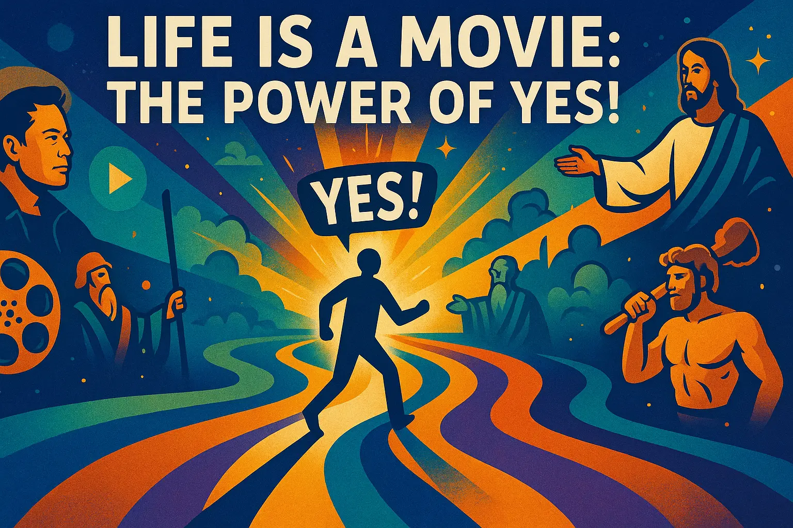

## Life Is A Movie: The Power of "Yes!"

The concept of embracing destiny and taking bold steps towards an uncertain future is a timeless theme that has been echoed throughout history. Many individuals who have shaped the world have had to make difficult choices, often leaving behind their families, homes, and comfort zones to pursue a higher calling. This pattern of behavior is not unique to any one person or group, but rather a common thread that weaves together the stories of heroes and visionaries from various walks of life.

From biblical figures like Jesus, Moses, and Hercules, to modern-day icons like Elon Musk and Bill Clinton, the narrative of abandoning familiarity and embracing the unknown is a recurring one. It is a test of courage, resilience, and determination, one that separates those who are willing to take risks and challenge the status quo from those who prefer to play it safe. The primary test of heroes, as seen in the stories of Jesus and his disciples, involves:

* Leaving your family, especially any children, for at least a year
* Traveling to foreign lands, for at least a year (usually 5)
* Accepting the offer immediately (Jesus gave each disciple less than 5 minutes to decide, and most heroes have less than a day, almost always)
* Never aborting, or giving up on the opportunity

The idea that life is like a movie or a video game, where the protagonist is presented with opportunities and challenges that must be navigated in order to progress, is a compelling one. It suggests that the universe is constantly presenting us with choices and opportunities, and that our responses to these challenges determine the trajectory of our lives. When we say "yes" to an opportunity, we open ourselves up to new experiences, resources, and connections that can help us grow and achieve our goals.

On the other hand, when we hesitate or say "no" to an opportunity, we may be passing up a chance to fulfill our potential and live a more authentic, meaningful life. This is not to say that every opportunity is right for every person, but rather that we should approach life with a sense of curiosity, openness, and willingness to take risks.

The concept of writing down future versions of reality and manifesting them into being is also an intriguing one. By putting our desires and intentions into words, we can create a kind of blueprint for our lives, one that can help guide us towards our goals and attract the resources and support we need to achieve them. This is not just a matter of positive thinking or wishful thinking, but rather a way of tapping into the deeper currents of reality and aligning ourselves with our highest potential.

Ultimately, the choice of how to live our lives is ours alone. We can choose to play it safe, to follow the familiar paths and routines that have been laid out for us, or we can choose to take a more daring approach, one that involves embracing uncertainty, taking risks, and trusting in the universe to support us on our journey. By living our lives like a movie, where every moment is an opportunity to create, to grow, and to evolve, we can unlock our full potential and create a life that is truly extraordinary.
